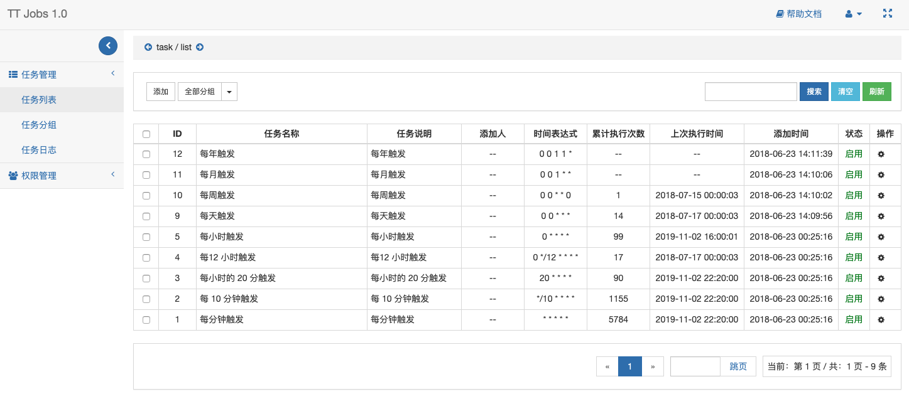

# TT Jobs

基于 [Swoole](https://www.swoole.com/) 定时管理系统 (Power by **EasySwoole© v1.0**)

## UI



## 环境要求

- php >= 5.6
- swoole >= 1.9.23
- inotify >= *

## 配置

1. 修改 `App/Cron/Conf` 目录下配置

```
App/Cron/Conf/config.ini    # 指定当前环境
App/Cron/Conf/dev.php       # 开发环境配置
App/Cron/Conf/pro.php       # 生产环境配置
```

2. `App/Cron/Runtime` 目录可写权限

3. 导入 `App/Cron/Schemas/tt_jobs.sql` 表结构 

## 运行

```
php App/Cron/bin/server start --d
```

浏览器访问 http://localhost:9501

```
admin: admin    # 管理员
demo: demo      # demo
```

## 注意事项

swoole >= 4.3.0 需要安装 [swoole Async 模块](https://github.com/swoole/ext-async)

```
git clone https://github.com/swoole/ext-async.git
cd ext-async
git checkout v.4.4.7 # 切换版本至 swoole 相同版本
phpize
./configure
make -j 4
sudo make install
```


## TODO

- [ ] 全局常量

## v2.0 TODO

- [ ] 分布式